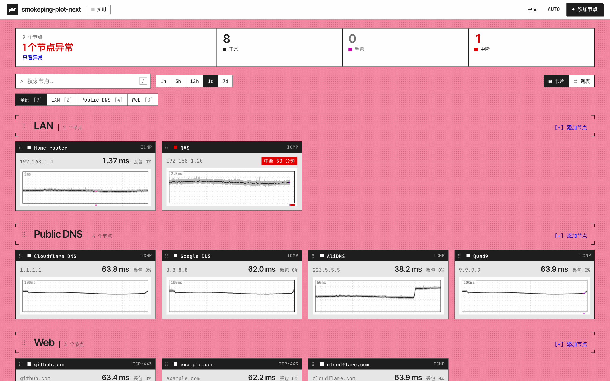
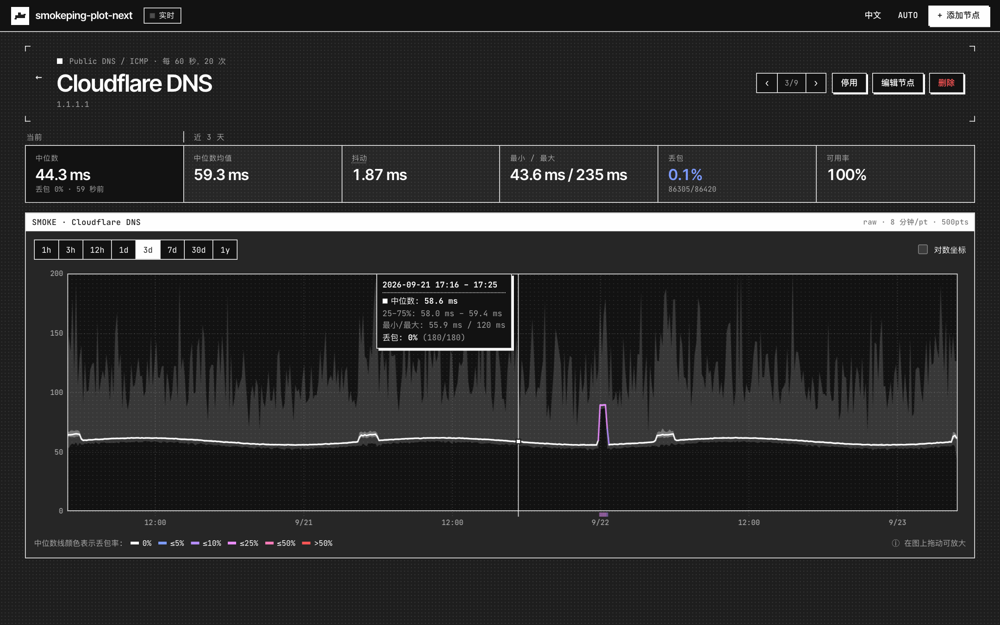
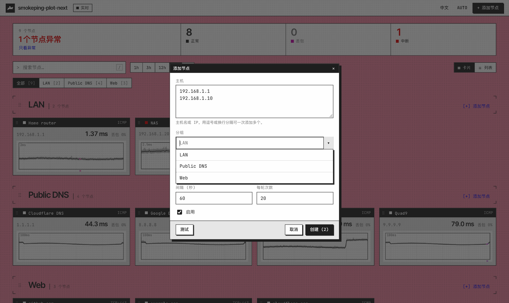
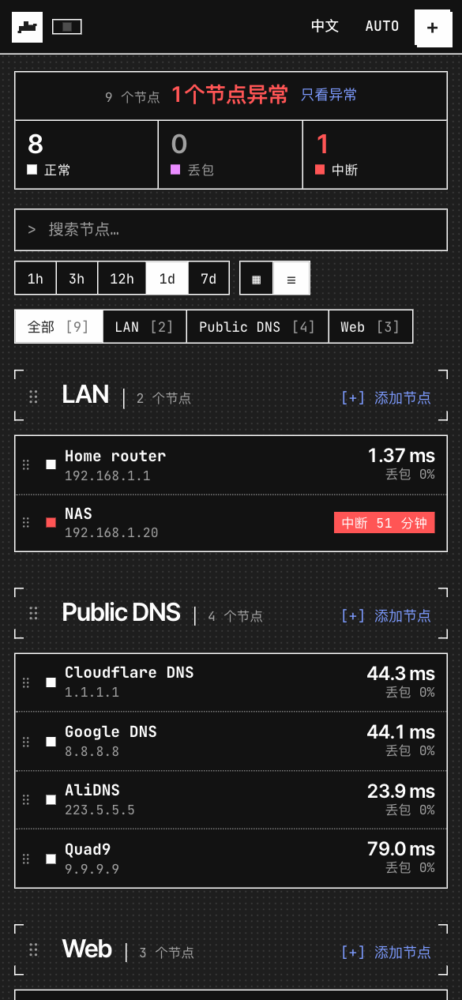

# smokeping-plot-next

一个面向局域网的延迟/丢包监测工具，复刻 [SmokePing](https://oss.oetiker.ch/smokeping/) 的核心思路：
每轮对目标发送 N 个探测包，用"烟雾图"展示延迟分布（中位数 + 分位区间），并用颜色表示丢包率。

单个二进制文件内嵌前端，SQLite 存储，`docker compose up` 即可部署；Web UI 同时适配桌面与手机，
可直接在页面上增删监控节点。

*A self-contained SmokePing-style latency monitor: Go backend (ICMP/TCP multi-ping probes, SQLite,
REST + SSE), React web UI with smoke graphs, responsive for desktop and mobile.*

## 截图

| 总览（浅色） | 节点详情（深色） |
|---|---|
|  |  |

| 添加节点 | 手机端（列表视图） |
|---|---|
|  |  |

## 功能

- **探测**：ICMP ping（纯 Go 实现，无需 fping）与 TCP connect；每轮 N 次（默认 20），间隔可配
- **烟雾图**：min–max 与 25–75% 分位烟雾带、按丢包率着色的中位数线、底部丢包条；对数坐标、拖拽缩放、hover/触摸提示
- **多分辨率归档**：原始样本保留 30 天，小时级汇总保留 2 年（类似 RRD 的多级 RRA），长时间范围自动切换
- **实时更新**：SSE 推送，新样本秒级出现在页面上
- **状态总览**：顶部显示正常 / 丢包 / 中断 / 无数据的节点数，点击即筛选；中断节点显示已中断多久，长时间没有新数据的节点标记为"无数据"；浏览器标签页标题和图标随整体状态变化
- **节点管理**：Web UI 添加 / 编辑 / 删除 / 暂停节点，支持分组、批量添加、添加前测试连通性
- **拖拽排序**：拖卡片标题栏的 ⠿ 手柄在组内排序或拖进其他分组；拖分组标题旁的 ⠿ 调整分组先后；手机上长按手柄再拖。顺序保存在服务端，所有设备一致
- **响应式 UI**：桌面卡片网格，手机单列 + 底部抽屉表单；深色 / 浅色主题跟随系统；中英文界面
- **部署简单**：单二进制 + SQLite；Docker 镜像约 20 MB；可选 HTTP Basic Auth

## 快速开始

三种部署方式，任选其一。服务默认监听 `:8080`（所有网卡），局域网内其他机器直接访问 `http://<监测机IP>:8080`。

### 方式一：systemd 一键安装（Linux，推荐）

```bash
curl -fsSL https://raw.githubusercontent.com/pomhg/smokeping-plot-next/main/deploy/install.sh | sudo bash
```

或从 Release 下载对应架构的 tar.gz 解压后运行 `sudo ./deploy/install.sh`。脚本会：

- 安装二进制到 `/usr/local/bin`，配置写到 `/etc/smokeping-plot-next/env`，数据在 `/var/lib/smokeping-plot-next`
- 安装并启动系统级 systemd 服务，开机自启；服务以**非 root 动态用户**运行，通过 `CAP_NET_RAW` 发 ICMP
- 打印访问地址和防火墙放行命令

**没有 root 权限？** 用 `--user` 装成当前用户的服务（`systemctl --user` 管理，`loginctl enable-linger` 保证登出后继续运行）：

```bash
curl -fsSL https://raw.githubusercontent.com/pomhg/smokeping-plot-next/main/deploy/install.sh | bash -s -- --user
```

ICMP 需要原始套接字；用户模式下脚本会尝试 `sudo setcap cap_net_raw+ep` 给二进制授权（只需一次）。没有 sudo 时请管理员执行以下任一命令：

```bash
sudo setcap cap_net_raw+ep ~/.local/bin/smokeping-plot-next
sudo sysctl -w net.ipv4.ping_group_range="0 2147483647"
```

常用管理命令（用户模式把 `sudo systemctl` 换成 `systemctl --user`，`journalctl` 加 `--user`）：

```bash
sudo systemctl status smokeping-plot-next
sudo systemctl restart smokeping-plot-next
sudo journalctl -u smokeping-plot-next -f
sudo nano /etc/smokeping-plot-next/env      # 改端口、保留期、Basic Auth 等，改完 restart
```

升级：重新运行同一条安装命令即可（保留数据和配置）。卸载见下文。

同一个脚本的其他参数：`--port 80`（配合 `CAP_NET_BIND_SERVICE` 可直接用 80 端口）、`--version v0.2.0`、`--binary ./bin/smokeping-plot-next`（用本地编译的二进制）。仓库为私有时设置 `GITHUB_TOKEN` 环境变量再运行。

### 方式二：Docker Compose

```bash
git clone https://github.com/pomhg/smokeping-plot-next.git
cd smokeping-plot-next
docker compose up -d --build
```

数据保存在 `./data/`。compose 文件已加 `cap_add: NET_RAW`。

### 方式三：本地编译

需要 Go ≥ 1.23 与 Node ≥ 20：

```bash
make build                 # 构建前端并编译到 bin/smokeping-plot-next
./bin/smokeping-plot-next  # 前台运行，或
make install               # = 编译 + sudo ./deploy/install.sh（systemd 系统服务）
make install-user          # = 编译 + ./deploy/install.sh --user
```

裸跑二进制时 ICMP 权限同上（root / setcap / ping_group_range）。macOS 上非特权 ICMP 开箱即用。程序启动时自动检测可用的套接字模式（`PROBE_PRIVILEGED=auto`）。

### 卸载

systemd 安装（root 与 `--user` 模式对应）：

```bash
sudo ./deploy/install.sh --uninstall            # 停止并删除服务与二进制，保留 /etc/smokeping-plot-next 和 /var/lib/smokeping-plot-next
sudo ./deploy/install.sh --uninstall --purge    # 连同配置和数据一起删除
./deploy/install.sh --uninstall [--purge] --user # 用户模式
```

没有仓库目录时也可以直接：`curl -fsSL https://raw.githubusercontent.com/pomhg/smokeping-plot-next/main/deploy/install.sh | sudo bash -s -- --uninstall --purge`。

Docker Compose：

```bash
docker compose down            # 停止并删除容器，保留 ./data
docker compose down --rmi local && rm -rf ./data   # 连镜像和数据一起删
```

本地编译运行的：`make uninstall`（等价于 `./deploy/install.sh --uninstall`），或直接删掉 `bin/` 与 `data/`。

### 防火墙放行

```bash
sudo ufw allow 8080/tcp                                   # Ubuntu/Debian (ufw)
sudo firewall-cmd --permanent --add-port=8080/tcp && sudo firewall-cmd --reload   # RHEL/Fedora
```

Web UI 没有内置登录；局域网之外暴露请开启 `AUTH_USER`/`AUTH_PASS`（HTTP Basic Auth）或放在反向代理后面。

## 配置

全部通过环境变量（或 `-listen` / `-data` 参数）。systemd 安装时写在 `/etc/smokeping-plot-next/env`（用户模式 `~/.config/smokeping-plot-next/env`），Docker 写在 `docker-compose.yml` 的 `environment` 里：

| 变量 | 默认 | 说明 |
|---|---|---|
| `LISTEN` | `:8080` | 监听地址 |
| `DATA_DIR` | `./data` | SQLite 数据目录 |
| `DEFAULT_STEP` | `60` | 新节点默认探测间隔（秒） |
| `DEFAULT_PINGS` | `20` | 新节点每轮默认探测次数 |
| `PING_INTERVAL` | `500ms` | 同一轮内两次探测之间的间隔 |
| `PING_TIMEOUT` | `2s` | 单次探测超时 |
| `PROBE_PRIVILEGED` | `auto` | ICMP 套接字模式：`auto` / `true`（raw）/ `false`（UDP） |
| `RAW_RETENTION_DAYS` | `30` | 原始样本保留天数 |
| `ROLLUP_RETENTION_DAYS` | `730` | 小时级汇总保留天数 |
| `AUTH_USER` / `AUTH_PASS` | 空 | 同时设置则开启 HTTP Basic Auth |
| `LOG_LEVEL` | `info` | `debug` 打印每个 API 请求 |
| `TZ` | 系统 | 时区（仅影响日志；图表使用浏览器本地时区） |

每个节点可单独设置探测方式、端口、间隔与每轮次数。

## 界面

- **总览**：按分组显示所有节点，可切换卡片 / 列表两种布局；每个节点有当前中位数 / 丢包率与最近 1h–7d 的迷你烟雾图；支持搜索、分组与状态筛选（筛选时暂停拖拽）。快捷键：`/` 搜索，`Esc` 清除筛选
- **节点详情**：1h ～ 1y 时间范围、拖拽缩放、对数坐标、区间统计（中位数均值、抖动、min/max、丢包、可用率）；`‹ ›` 或键盘 ← → 在节点间切换
- **添加节点**：主机栏可粘贴多行 / 逗号分隔的地址一次批量添加；「测试」按钮即时探测 5 次

## API

前端使用的 REST 接口，也可以直接调用：

| 方法 | 路径 | 说明 |
|---|---|---|
| `GET` | `/api/targets` | 节点列表（含最新一轮结果） |
| `POST` | `/api/targets` | 新建 `{name, host, group, probe, port, step, pings, enabled}` |
| `PUT` | `/api/targets/{id}` | 更新 |
| `PUT` | `/api/targets/order` | 节点排序 `{items:[{id, group, sortOrder}]}` |
| `GET`/`PUT` | `/api/groups/order` | 分组顺序 `{groups:["LAN","Internet"]}` |
| `DELETE` | `/api/targets/{id}` | 删除（含历史数据） |
| `GET` | `/api/targets/{id}/series?from=&to=&points=` | 聚合时间序列（unix 秒；自动选择原始/汇总表） |
| `GET` | `/api/series?ids=1,2&from=&to=&points=` | 多节点批量序列 |
| `POST` | `/api/probe` | 一次性探测 `{host, probe, port, count}` |
| `GET` | `/api/events` | SSE：`sample`（新样本）、`targets`（节点变更） |
| `GET` | `/api/config`, `/api/stats` | 运行配置与计数 |

序列中的每个点：`{ts, sent, recv, loss, min, p25, median, p75, max, avg}`（毫秒；无应答时为 `null`）。

## 开发

```bash
make dev-api     # 终端 1：go run，监听 :8080
make dev-web     # 终端 2：Vite 开发服务器 :5173，/api 代理到 :8080
```

发布：打 `v*` tag 推送后 GitHub Actions 会交叉编译 linux amd64/arm64/armv7 与 darwin 并创建 Release，`install.sh` 默认下载最新 Release。

目录结构：

```
deploy/                    install.sh、systemd unit、env 模板
cmd/smokeping-plot-next/   入口
internal/config/           环境变量配置
internal/probe/            ICMP / TCP 探测（pro-bing）
internal/scheduler/        按 step 对齐的探测循环
internal/store/            SQLite：targets / samples / rollups
internal/api/              REST、SSE、静态文件
web/                       React + TypeScript + Vite 前端（构建后嵌入二进制）
```

## 与 SmokePing 的对应关系

| SmokePing | smokeping-plot-next |
|---|---|
| `step` / `pings` | 每节点 `step` / `pings` |
| FPing / TCPPing 探针 | `icmp` / `tcp` |
| RRD 多级 RRA | `samples`（原始）+ `rollups`（小时） |
| 烟雾图（median 线 + smoke） | Canvas 绘制的 min–max / p25–p75 烟雾 + 按丢包着色的中位数 |
| 配置文件 Targets 段 | Web UI 增删改，存于 SQLite |

## License

MIT
